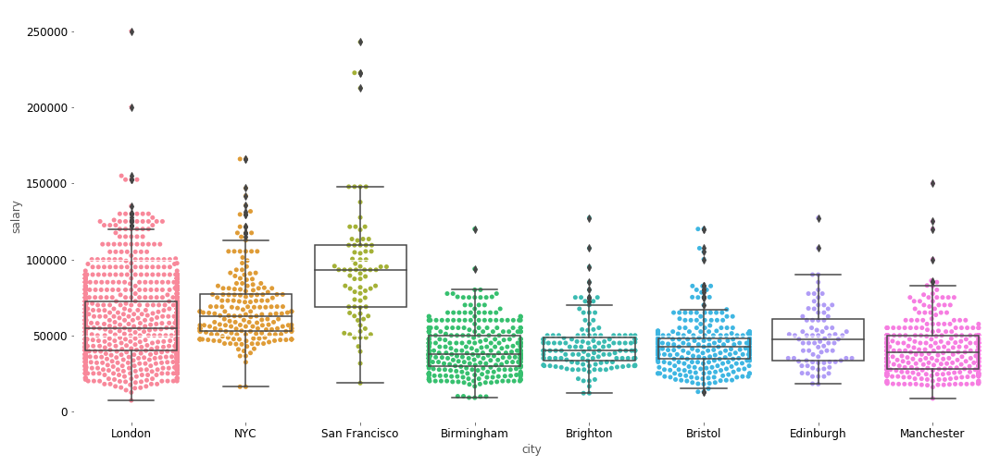
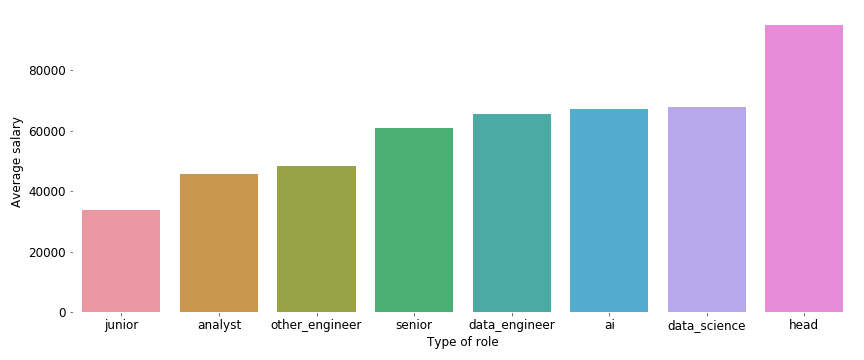
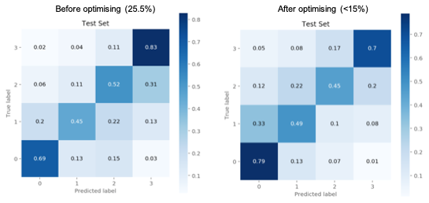
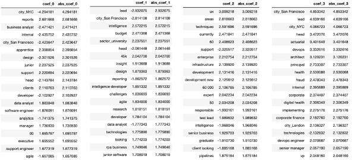

# Predicting salaries

The aim of this project was to scrape data science job postings from the jobs board website, [Indeed](https://www.indeed.co.uk/?from=gnav-jobsearch--jasx), clean and identify important features in the data obtained and create a classification model to predict the quartile the salaries fell into. The project was framed in the perspective of working for a firm who want to be competitive in the hiring market for data scientists and want to determine the factors most important predicting salary and use this information to accurately estimate a competitive salary when making offers.

## Data and Web Scraping

The first part of the project was to use BeautifulSoup to scrape job postings, related to data science, from Indeed. The notebook `web-scraping` includes the code for scraping the relevant postings from 8 cities (London, Manchester, Brighton, Birmingham, Bristol, Edinburgh, New York and San Francisco) and the steps takes to clean the obtained data. 

`salary-full.csv` contains the cleaned dataset, with 3101 postings containing the following information:

- Company
- Job title 
- Salary (if any)
- Preview of job description
- Rating (if any)
- Location 
- City (some postings provided districts and I added in a city column to distinguish between cities easily)

## Feature Engineering and EDA 

Intial EDA of the data included visualising the salary distribution across the different cities using a swarmplot and boxplots. We can see that London, NYC and San Fran (as expected) have higher median salaries than the other cities with San Fran's being the highest - although San Fran does have fewer salaries (as US cities seldom seem to share salary information on postings) compared to London so hard compare the two accurately.

I also tried a range of feature engineering tehniques, using Regex and NLP, to create useful features from the job titles, descriptions and ratings:
- Dropped irrelevant job postings using regex, e.g. dropped all the rows with words like "technician" in their title without containing words like "data scientist", as there were a few like this e.g. "BIM Technician/Data Scientist"
- Used regex to categorise the job postings into different sectors, e.g. recruitment, govt, university, finance and so on. 
- Cleaned and turned the rating feature in a categorical variable to accomodate for null values
- Used regex to classify senority and type of roles the job posting was indicating. E.g. as the figure shows, postings with the word 'head' in the job title indicated a higher salary

- Used NLP (TfidVectorizer) on the text from job titles and descriptions

## Modelling 
To predict salary the most appropriate approach would be a regression model, but the aim of this project was to turn this into a classification project where our model would predict which quartile the salary would fall under. Turning this into a classification problem could also help smooth out the moise from any extreme salary ranges. The notebook `predicting_salaries` contains the full code.

So I prepared the target variable by splitting the salaries into 4 different quartiles, giving me a baseline accuracy of ~0.26 as expected. **I tested many different models using Gridsearch and found that Logisitic Regression with Ridge regularisation worked the best.**

### Scoring methods

This is how I decided which model was the "best":

- **Mean CV Score**: This measures the accuracy of the models but in classification, accuracy isn't all we should be concerned about.

- **Confusion Matrix Percentage/Count**: This is a score I made up to track how well the model minimises the lower right-hand triangle of the confusion matrix - specifically for the test set. This project brief specifies that the firm would rather make an offer lower than the true value (vs higher) as you can always re-offer higher without upsetting expectations. This effectively means you want the lower right-hand triangle of the confusion matrix to be minimised. I added up these values and divided through by the number of samples to get the fraction of lower right-hand triangle. I only judged this score based on the test set because model would have overfit to the train set. 

### Best model and optimisation 

Logistic Regression with Ridge had the best mean cv score, after gridsearching, as well as the lower number of points in the lower right-hand triangle of the confusion matrix. In order to optimise this further, I decided to get the best mean cv score possible while keeping the percentage of the lower right-hand triangle of the confusion matrix to below 15% by:

- Manipulating the probability thresholds such that before predicting a class, it checks the difference in probabilites for a lower class, and only assigns the higher class if the difference in probability is more than 0.131818 (optimal threshold through testing).
- Simulataneously adjusting the class weights for the algorithm to try to improve accuracy of either the upper two classes or lower two classes. 

In the end, the best weights were {0:1, 1:1, 2:0.888889, 3:0.888889} with an accuracy score of 0.604878 and probability threshold of 0.131818. It improved the accuracy, presumably because it got more of class 0 and 1 right while keeping the confusion matrix percentage below 15%. The image below shows the improvement in the lower right-hand triangle from 25.5% to below 15% after the optimisation. 

### Feature importances

The feature importances, in this case words of importance, were in line with expectations with 'lead' and San Francisco seeming to positively influence for predicting class 3 (while negatively impacting class 1) while 'junior' and 'data analyst' seem to positively influence class 0. 

## Conclusion
Overall this project was a great opportunity to practise web scraping, learn about Regex for feature engineering and understand classification models in more depth by experimenting with probability thresholds and class weights. While an accuracy score of 0.605 is a sizeable increase from the baseline score of 0.26, this problem would have been better suited to a regression model for practical purposes. 

